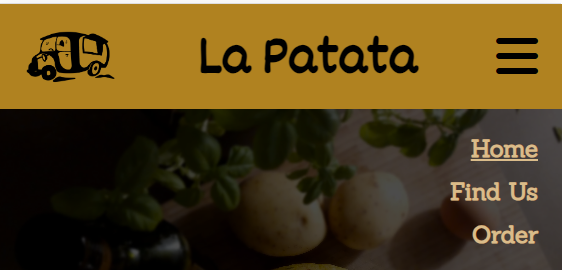
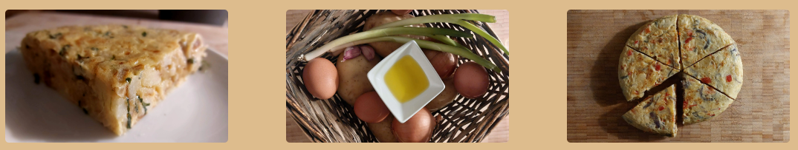

# La Patata

La Patata is a fictional food truck business selling Spanish tortillas in different food markets in London, UK.

The purpose of this website is to promote the business to London residents as well as people visiting London. The website provides information about the menu, ingredients used as well as the locations and the timetable of the food truck. It also provides a function to pre-order tortillas for collection to local people who would like order several tortillas for example for private family events.

## User Experience (UX)

### Business Goals

* This is a Business to Consumer (B2C) website that aims to increase the number of people who visit the food truck.
* The website provides information about the menu and ingredients used to convince potential customers of the quality of the product.
* The website conveys the feeling of relaxed and fun urban eating experience.
* The website offers the possibility to pre-order tortillas to encourage customers to order larger amounts.

### User Stories

* As a visitor to London, I want to be able to find information about the locations and opening times easily using my mobile phone so that I can find the business while on the move.
* As a local food-lover, I want to be able to find information about the product and the ingredients used so that I can understand more about the quality of the product.
* As a regular customer, I want to be able to buy several tortillas so that I can serve them in my family event.

### Wireframes

[Balsamiq](https://balsamiq.com/) User Interface wireframing tool was used to design the structure of the website.

|  Page    |                         Mobile                                  |                         Desktop                                   |
|  ---     |                         ---                                     |                         ---                                       |
|  Index   |    |    |
|  Find Us |||
|  Order   |    |    |

## Features

### General

* The site was developed using "mobile first" development approach to ensure good User Experience for those using mobile phones and other smaller devices.
* The site is fully responsive across all device sizes.
* The site uses consistant colors, fonts and designs in all pages.

#### Favicon

* The Favicon is a simple letter P on a light brown background and it uses the same font than the main heading "La Patata". The background colour is the same colour that is being used across the site for the headers and footers. The letter P stands for patata, potato in Spanish, the name of the business and the main ingredient of the product.  

#### Header

* The header contains an illustration of a food truck to clearly communicate to the customers the type of the food business.
* The header clearly shows the name of the business "La Patata" which means potato in Spanish making reference to one of the main ingredient of Spanish tortilla, potato.
* The navigation bar for mobile phones and tables is a dropdown menu that can be toggled open/close to save space on smaller screen. The design for the menu was inspired by Code Acedemy's Love Running Project. When the menu is open, it has transparent background and is displayed slightly on top of the hero image on the index.html page.  

* When using a larger device than tablet the navigation menu is displayed horizontally. The background of the navigation menu remains slightly transparent and the menu is displayed over the hero image.  

#### Footer

* The footer has Facebook and Instagram icons that contain links to the social media sites as well as mail icon that users can click to send an email to the company. The footer also contains Copyright information. When using a mobile phone the social media icons are located on the left-side, and when using a tablet or a larger device, the icons are in the centre.  

### Landing Page

* The landing page contains all the key information and eye-catching images to encourage potential customer to try the product.
* The page was designed to convey a feeling of high-quality product being sold by a small, friendly, urban business.

#### Hero Image

* The Hero image shows a Spanish tortilla and some of its raw ingredients placed on a wooden board. The image conveys authecity, quality and freshness of the product, and gives a friendly, homely feel to the customer. The image gives the customer an insight into the business' traditional approach of making tortilla.
* The Hero image is fully responsive and the size of the image adjusts according to the screensize always ensuring that the product (tortilla) catches the customer's attention.  

#### Tortilla Menu

* The tortilla menu lists all the different types of tortillas available and their prices. The menu is lists all the ingredients so that customers with dietary requirements are able to make an informed decision whether the product is suitable for them.
* The tortilla menu has been designed to represent a menu hand-written on a chalkboard that are commonly used in food markets. The font style was selected as it is clear but gives the impression that it has been hand-written and font color is white to represent chalk.  

#### About Us

* The About Us section gives customers information about the business owners and demonstrates their passion towards Spanish food and making a high-quality product.
* The section has a link to "Find Us" page as a call to action to visit one of the food market where the food truck operates.  

#### Tortilla images

* An image of a tortilla slice is displayed when mobile phones and tablets are being used. This image gives the customer an idea of the portion they would be purchasing.
* When a laptop is being used, three images are displayed: an image of tortilla slice, an image of the ingredients and an image of a full tortilla cut into six slices.
* On larger desktop screens, only the tortilla slice image is being displayed again to make the layout of the page more visually appealing and avoid the images from looking too spread out on the larger screens.  
 

#### How to Enjoy Section

* The How to Enjoy Section gives light-hearted suggestions on how and when to eat tortillas. The section encourages customers to engage with the business and try the product.
* The section includes two calls to action to encourage customers' to try the product: a link to the Find Us page and a link to the Order page.  

### Find Us page

* The Find Us page lets the customers knows when and where they can visit the business, and how to contact the business via email or phone.

#### Where to Find Us section

* This section shows the names and addresses of two locations where the food truck stops, and gives the opening times.
* Both locations are also shown on a Google map using an iframe to allow customers find the business easily. This function serves especially customers who are on the move and using a mobile phone to looking for a place to eat now.  

#### Contact us section

* This section shows an photo of the fictional food truck to help customers to locate the business when visiting a food market.
* Mobile phone number and email address are displayed to allow customers to contact the business easily.  

### Order page

* This page allows regular customers to place a larger order.

#### Order information

* This section explains how to pre-order tortillas and reminds customers of the days and locations when they can collect their order.
* The terms and conditions have been placed inside a disclosure widget to improve user experience by saving space on customers' screens when they are not reading the terms and conditions.  
 

#### Order form

* The form allows customers to pre-order a larger number of tortillas for collection easily.
* The form uses built-in client-side form validation to ensure that all the required data is submitted in correct format to prevent issues and delay with customer orders.  

## Technologies Used

### Languages Used

* [HTML5](https://html.com/html5/)
* [CSS3](https://www.w3.org/Style/CSS/)

### Frameworks, Libraries and Programmes Used

* [Balsamiq](https://balsamiq.com/) was used for designing the project and creating wireframes to communicate the vision.
* [Codeanywhere](https://codeanywhere.com/) was used for writing, committing and pushing code to GitHub.
* [GitHub](https://github.com/) was used for storing the project.
* [Google Fonts](https://fonts.google.com/) was used to import the selected fonts.
* [Font Awesome](https://fontawesome.com/) was used to add icons to the site to give the user a visual representation of some of the information presented.
* [Chrome DevTools](https://developer.chrome.com/docs/devtools) were used regularly throughout the development of the project to test and troubleshoot.
* [Pixelied](https://pixelied.com/convert/) was used to covert the images used to webp format.
* [TinyPNG](https://tinypng.com/) was used to optimise the images by reducing their size.
* [Favicon.io](https://favicon.io/) was used to create the Favicon.
* [Responsive Design Checker](https://www.responsivedesignchecker.com/) was used to check the site's responsiveness on different devices.
* [Am I responsive?](https://ui.dev/amiresponsive) was used to create the mockup image of the landing page on different devices.

## Testing

### Code Validation

* The [W3C Markup Validator](https://validator.w3.org/) and [W3C CSS Validator](https://jigsaw.w3.org/css-validator/) were used to validate all the pages to ensure that the project meets the current Web Standards and is from any unintended syntax errors and mistakes that could use issues with accessibilty and usability.

* The pages were validated once half-way through the development. In index.html, W3C Markup Validator found an issue of two sections, hero image and tortilla images, not containing a heading. This was rectified by replacing these section tags with div tags. No issues were found on the other pages or with the CSS code. The Validator highlighted several times that the trailing slash on void elements had no effect. However, these were not removed as they had been added by Prettier when the code had been formatted.

  * Warning messages: 
  * Info messages after the highlighted issue was resolved: 
